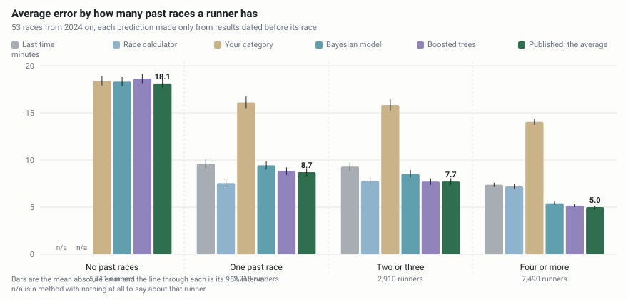
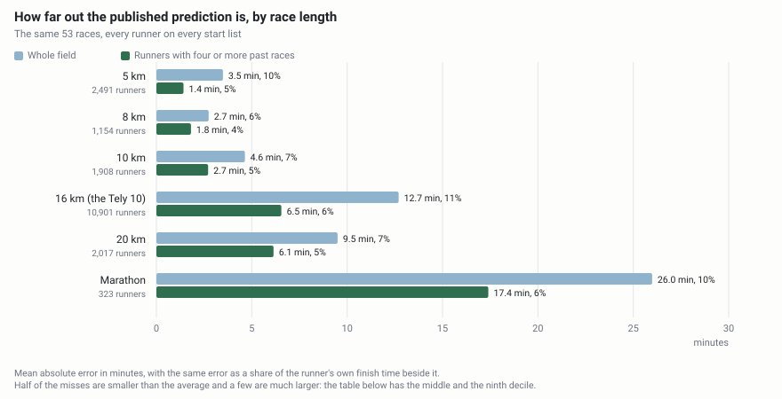
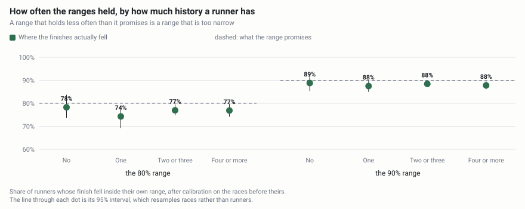

# The Whole Field, Called Before the Gun

Before the gun, a predicted finish time and placing for every registered runner in a field of
thousands, from their public race history, published in advance, with the error published once
the results are in.

For a runner that is a goal time with an honest range instead of a hunch. For a race director
it is pacing, corral and medical staffing planned from expected finish times rather than
guesses. For a reader who wants to check the work, it is a forecasting system whose every
prediction is committed, tagged and hashed before the race it describes, so the record cannot
be edited once the results are in.

**The site: [finishline.peterparker.ca](https://finishline.peterparker.ca)**, every live race
and the whole method in pictures, with a search box for your own name.

**Status: built and measured, waiting for a start line.** Eighteen years of results pages are
parsed, 23,830 runners are resolved out of them with no runner ID to join on, every course's
difficulty is measured from the finishes, and a whole field is predicted, first-timers
included. What has not happened yet is a prediction: nothing here is tagged. The first goes out
on 2026-09-27 for the Turkey Tea 10 km on 2026-10-04, then Cape to Cabot 20 km on 2026-10-18.

## How good is it

- **5.0 minutes** of average error for a runner with four or more past races (95% interval 4.8
  to 5.2), against **7.4 minutes** for the best simple rule this same pipeline can compute.
  **32% closer.**
- It answers for **every runner on the start list**. Nearly a third of a field here, 5,711 of
  18,824, has no past result at all, which no rule of thumb can answer for; those predictions
  carry the largest error in the tables and the error is published, not hidden.
- **4.1 places closer** than that rule on the same runners (95% interval 2.0 to 6.7), which is
  the number a race director plans from.
- Every prediction carries a range, and the ranges are checked: the 80% range held 74 to 78% of
  the time and the 90% range 88 to 89%, on races the calibration had never seen.

**An average miss is not a margin every prediction carries.** For the front of a 5 km field,
with four or more past races, the average miss is 45 seconds, half of those runners were inside
28 seconds, and nine in ten inside 1.6 minutes. The tables below give that shape by race length
and by where a runner finishes in their own field, because a single average hides both.

Measured on 18,824 predictions over 53 races from 2024 on, each made only from results dated
strictly before it. Every table on this page is written by `finishline report` from that one
run, and none of them is edited by hand.

## Contents

- [The measured result](#the-measured-result), against the best simple rules, by race length,
  by position in the field, on the order of finish and on the ranges
- [What the archive gave up](#what-the-archive-gave-up): what was read, how hard each course
  runs, what the weather costs
- [What this does not do](#what-this-does-not-do), starting with the data it refuses to use
- [What went wrong on the way](#what-went-wrong-on-the-way): the designs the data refuted
- [How it works](#how-it-works) and [how to run it](#run-it-yourself)
- [How it is built](#how-it-is-built), and [whose judgement is in it](#judgement-and-what-is-borrowed)

## The measured result

Every race from 2024 on, each runner predicted only from results dated strictly before that
race. Three simple rules are in the table beside the models, because a model that is not
compared with the obvious answer is not measured at all. Coverage sits beside error in every
row: a method that answers for the easy half of a field is not better than one that answers
for all of it.

- **`carry-forward`**: your last race, converted to this distance.
- **`best-equal-vdot`**: your best recent race read off Daniels' curve, the race calculator a
  runner would use.
- **`category-median`**: the middle of your age and sex category.
- **`hierarchical`** and **`lightgbm`** are the two models; **`blend`** is what the site
  publishes, the average of the two.



The chart and the table under it are the same numbers, both redrawn by `finishline report`.
Nothing here is drawn by hand.

The first table is the headline. The three after it pair the models on the same runners, race by
race, which is how a difference of a few tenths of a percent is told apart from noise, with the
intervals resampling races rather than runners because runners in one race share a morning. What
they say: the trees beat the Bayesian model wherever a runner has any history, the average of
the two beats both, and where the average loses it loses by 0.08 points at one depth.

<!-- finishline:baselines -->
| Prior results | Runners | Model | Answered | MAE, minutes (95% CI) | Mean % error | Skill vs carry-forward |
|---|---:|---|---:|---|---:|---:|
| 0 | 5711 | `carry-forward` | 0% | - | - | baseline |
|  |  | `best-equal-vdot` | 0% | - | - | - |
|  |  | `category-median` | 95% | 18.4 (17.9 to 18.9) | 18% | - |
|  |  | `hierarchical` | 100% | 18.3 (17.9 to 18.8) | 18% | - |
|  |  | `lightgbm` | 100% | 18.6 (18.1 to 19.1) | 17% | - |
|  |  | `blend` | 100% | 18.1 (17.6 to 18.6) | 17% | - |
| 1 | 2713 | `carry-forward` | 100% | 9.6 (9.2 to 10.0) | 10% | baseline |
|  |  | `best-equal-vdot` | 64% | 7.5 (7.1 to 8.0) | 8% | 21% |
|  |  | `category-median` | 96% | 16.1 (15.5 to 16.7) | 16% | -68% |
|  |  | `hierarchical` | 100% | 9.4 (9.0 to 9.9) | 10% | 2% |
|  |  | `lightgbm` | 100% | 8.8 (8.4 to 9.2) | 9% | 8% |
|  |  | `blend` | 100% | 8.7 (8.3 to 9.1) | 9% | 9% |
| 2 to 3 | 2910 | `carry-forward` | 100% | 9.3 (8.9 to 9.7) | 9% | baseline |
|  |  | `best-equal-vdot` | 73% | 7.8 (7.4 to 8.2) | 8% | 16% |
|  |  | `category-median` | 95% | 15.8 (15.2 to 16.4) | 16% | -70% |
|  |  | `hierarchical` | 100% | 8.5 (8.2 to 8.9) | 9% | 8% |
|  |  | `lightgbm` | 100% | 7.7 (7.4 to 8.1) | 8% | 17% |
|  |  | `blend` | 100% | 7.7 (7.4 to 8.1) | 8% | 17% |
| 4 or more | 7490 | `carry-forward` | 100% | 7.4 (7.2 to 7.6) | 8% | baseline |
|  |  | `best-equal-vdot` | 87% | 7.2 (7.0 to 7.4) | 7% | 2% |
|  |  | `category-median` | 95% | 14.0 (13.7 to 14.4) | 18% | -90% |
|  |  | `hierarchical` | 100% | 5.4 (5.2 to 5.6) | 6% | 27% |
|  |  | `lightgbm` | 100% | 5.2 (5.0 to 5.3) | 6% | 30% |
|  |  | `blend` | 100% | 5.0 (4.8 to 5.2) | 5% | 32% |

`lightgbm` against `hierarchical` on the same runners. The difference is in mean absolute error as a percent of each runner's own finish time; negative favours `lightgbm`, and the 95% CI resamples races.

| Prior results | Runners | Races | MAE, minutes, `lightgbm` vs `hierarchical` | Difference, points of a finish time (95% CI) |
|---|---:|---:|---|---|
| 0 | 5,703 | 53 | 18.6 vs 18.3 | +0.67 (-0.85 to +1.60) |
| 1 | 2,707 | 52 | 8.8 vs 9.4 | -0.91 (-1.65 to -0.57) |
| 2 to 3 | 2,904 | 52 | 7.7 vs 8.5 | -1.00 (-1.39 to -0.79) |
| 4 or more | 7,480 | 51 | 5.2 vs 5.4 | -0.39 (-0.59 to -0.21) |

`blend` against `hierarchical` on the same runners. The difference is in mean absolute error as a percent of each runner's own finish time; negative favours `blend`, and the 95% CI resamples races.

| Prior results | Runners | Races | MAE, minutes, `blend` vs `hierarchical` | Difference, points of a finish time (95% CI) |
|---|---:|---:|---|---|
| 0 | 5,703 | 53 | 18.1 vs 18.3 | +0.07 (-1.05 to +0.65) |
| 1 | 2,707 | 52 | 8.7 vs 9.4 | -0.91 (-1.44 to -0.68) |
| 2 to 3 | 2,904 | 52 | 7.7 vs 8.5 | -0.92 (-1.19 to -0.77) |
| 4 or more | 7,480 | 51 | 5.0 vs 5.4 | -0.51 (-0.63 to -0.40) |

`blend` against `lightgbm` on the same runners. The difference is in mean absolute error as a percent of each runner's own finish time; negative favours `blend`, and the 95% CI resamples races.

| Prior results | Runners | Races | MAE, minutes, `blend` vs `lightgbm` | Difference, points of a finish time (95% CI) |
|---|---:|---:|---|---|
| 0 | 5,703 | 53 | 18.1 vs 18.6 | -0.59 (-0.96 to -0.13) |
| 1 | 2,707 | 52 | 8.7 vs 8.8 | -0.00 (-0.12 to +0.23) |
| 2 to 3 | 2,904 | 52 | 7.7 vs 7.7 | +0.08 (+0.02 to +0.20) |
| 4 or more | 7,480 | 51 | 5.0 vs 5.2 | -0.12 (-0.22 to -0.03) |
<!-- finishline:end:baselines -->

**None of those three rules was lying around to be beaten.** "You will run what you ran last
time" is trivial for one runner with one race in front of them, and is not trivial for a field
of several hundred: it needs eighteen years of results pages parsed, the same person's results
joined across them with no runner ID to go on, the last race converted to this distance through
Daniels' tables, and this course's difficulty measured against every other course in the
province. All of that is this repository, and the baselines are computed by it. So the
comparison is not this model against something a runner can look up. It is this model against
the best simple answer the same machinery can give, on the same runners, which is the harder
test and the only honest one.

**And a rule of thumb cannot answer for a third of the field.** Over the 53 scored races
carry-forward answers for 13,113 of 18,824 entrants (70%) and the race calculator for 10,403
(55%). The remaining 5,711 have nothing to carry forward. A race director planning a
finish-line clock needs the whole field, not the two thirds of it with a history.

### By race length

An average in minutes is not one claim across distances, so the error is given both ways:
minutes, which a race director plans with, and the share of a runner's own finish time, which
is what compares a 5 km with a marathon.



<!-- finishline:distances -->
`blend`, every race from 2024 on, grouped by race length. An average miss is not a margin every prediction carries, so the middle of the misses and the ninth decile are beside it: half of these runners were predicted closer than the one, nine in ten closer than the other. The percent in brackets is of each runner's own finish time.

| Race length | Runners | Typical finish, minutes | Average miss, whole field | Half within | 9 in 10 within | Average miss, 4+ races |
|---|---:|---:|---:|---:|---:|---:|
| 5 km | 2,491 | 28.2 | 3.5 min (10%) | 1.6 min | 8.7 min | 1.4 min (5%) |
| 8 km | 1,154 | 42.4 | 2.7 min (6%) | 1.6 min | 6.6 min | 1.8 min (4%) |
| 10 km | 1,908 | 58.2 | 4.6 min (7%) | 2.6 min | 11.4 min | 2.7 min (5%) |
| 16 km (the Tely 10) | 10,901 | 102.6 | 12.7 min (11%) | 7.4 min | 31.0 min | 6.6 min (6%) |
| 20 km | 2,017 | 129.3 | 9.5 min (7%) | 5.9 min | 21.7 min | 6.1 min (5%) |
| Marathon | 323 | 271.7 | 26.0 min (10%) | 20.2 min | 58.1 min | 17.4 min (6%) |
<!-- finishline:end:distances -->

### By where a runner finishes in their own field

The front of a field is predicted more tightly than the back of it, in both units. A runner's
own day-to-day variation is what no model can know, and there is more of it further back.
Runners with four or more past races only, so these columns differ by speed rather than by how
much history each group happens to have.

<!-- finishline:speeds -->
`blend`, every race from 2024 on, for runners with four or more prior results, by race length and by where they finished in their own race. Each cell is the mean absolute error in minutes and as a percent of the runner's own finish time.

| Race length | Front of the field (fastest quarter) | Mid-pack (middle half) | Later finishers (last quarter) |
|---|---|---|---|
| 5 km | 45 sec, 3.8% (372) | 1.3 min, 5.1% (572) | 3.4 min, 9.8% (158) |
| 8 km | 1.1 min, 3.3% (223) | 1.8 min, 4.2% (336) | 3.1 min, 5.6% (135) |
| 10 km | 1.6 min, 3.6% (319) | 2.5 min, 4.3% (441) | 4.8 min, 6.4% (192) |
| 16 km (the Tely 10) | 3.6 min, 4.7% (1,177) | 6.1 min, 5.9% (1,710) | 13.7 min, 9.3% (585) |
| 20 km | 4.3 min, 4.2% (304) | 6.1 min, 4.7% (555) | 8.5 min, 5.2% (264) |
| Marathon | 10.4 min, 4.8% (39) | 18.8 min, 6.8% (67) | 23.2 min, 6.9% (31) |
<!-- finishline:end:speeds -->

### The order of finish

<!-- finishline:placing -->
| Model | Races | Mean absolute place error | Spearman, predicted vs actual |
|---|---:|---:|---:|
| `carry-forward` | 53 | 24.6 | 0.836 |
| `best-equal-vdot` | 52 | 17.6 | 0.838 |
| `category-median` | 46 | 95.4 | 0.349 |
| `hierarchical` | 53 | 50.9 | 0.706 |
| `lightgbm` | 53 | 49.6 | 0.733 |
| `blend` | 53 | 48.7 | 0.728 |

The same runners: each model against `carry-forward`, both ranked among the runners both answered for in each race (races with at least 10 of them). Negative place error and positive Spearman differences favour the model; the 95% CI resamples races.

| Model | Races | Runners | Place error, model vs `carry-forward` | Difference (95% CI) | Spearman, model vs `carry-forward` | Difference (95% CI) |
|---|---:|---:|---|---|---|---|
| `best-equal-vdot` | 51 | 10,377 | 17.9 vs 19.0 | -1.1 (-2.4 to -0.1) | 0.849 vs 0.847 | +0.002 (-0.006 to +0.010) |
| `category-median` | 44 | 12,427 | 68.9 vs 27.9 | +41.1 (+20.3 to +66.9) | 0.368 vs 0.852 | -0.484 (-0.536 to -0.439) |
| `hierarchical` | 51 | 13,081 | 23.7 vs 25.5 | -1.8 (-3.1 to -0.7) | 0.857 vs 0.849 | +0.008 (-0.005 to +0.023) |
| `lightgbm` | 51 | 13,081 | 21.3 vs 25.5 | -4.2 (-6.7 to -2.0) | 0.875 vs 0.849 | +0.027 (+0.016 to +0.037) |
| `blend` | 51 | 13,081 | 21.3 vs 25.5 | -4.1 (-6.7 to -2.0) | 0.876 vs 0.849 | +0.027 (+0.015 to +0.039) |
<!-- finishline:end:placing -->

**Read the second table, not the first.** The first ranks each method among the runners it
answered for, so carry-forward is ranked over the 13,113 runners who have a past result while
the model is ranked over the whole field, first-timers included, whose order is close to a
guess. That is where its 48.7 comes from. The second ranks both over the same runners, race by
race: there the published model is 4.1 places better than carry-forward (95% interval 2.0 to
6.7), 21.3 against 25.5, with rank correlation 0.876 against 0.849. Both tables stay, because
scoring each method only on the subset that suits it is how a table stops being checkable.

### The ranges

A predicted time with a range is two claims, and the second one is checked here: the model's
own 80% and 90% ranges, and the same ranges after conformal adjustment on the races before each
one, split by how much history a runner has.



<!-- finishline:coverage -->
`blend`, every race from 2024 on. Each race's intervals are adjusted using only races dated before it, separately for each history depth. Coverage is the share of runners whose finish fell inside; the 95% CI resamples races, not runners, because runners in one race share its morning.

| Prior results | Level | Runners checked | Races | Model's own interval | After conformal | Median width, minutes (own to conformal) |
|---|---:|---:|---:|---|---|---|
| 0 | 80% | 5,641 | 51 | 77% (75 to 81) | 78% (74 to 84) | 52.1 to 52.8 |
| 1 | 80% | 2,648 | 47 | 75% (73 to 78) | 74% (69 to 79) | 20.8 to 20.4 |
| 2 to 3 | 80% | 2,835 | 47 | 74% (71 to 77) | 77% (75 to 79) | 18.4 to 19.8 |
| 4 or more | 80% | 7,380 | 50 | 80% (77 to 82) | 77% (74 to 80) | 13.4 to 12.2 |
| 0 | 90% | 5,641 | 51 | 87% (85 to 90) | 89% (85 to 93) | 67.9 to 72.6 |
| 1 | 90% | 2,648 | 47 | 85% (83 to 87) | 88% (85 to 90) | 28.5 to 31.4 |
| 2 to 3 | 90% | 2,835 | 47 | 84% (82 to 87) | 88% (87 to 90) | 24.7 to 28.2 |
| 4 or more | 90% | 7,380 | 50 | 89% (87 to 91) | 88% (86 to 90) | 18.3 to 17.2 |

`hierarchical`, every race from 2024 on. Each race's intervals are adjusted using only races dated before it, separately for each history depth. Coverage is the share of runners whose finish fell inside; the 95% CI resamples races, not runners, because runners in one race share its morning.

| Prior results | Level | Runners checked | Races | Model's own interval | After conformal | Median width, minutes (own to conformal) |
|---|---:|---:|---:|---|---|---|
| 0 | 80% | 5,649 | 51 | 77% (75 to 79) | 78% (73 to 82) | 54.4 to 55.2 |
| 1 | 80% | 2,654 | 47 | 73% (70 to 75) | 77% (73 to 79) | 20.9 to 23.3 |
| 2 to 3 | 80% | 2,841 | 47 | 71% (68 to 74) | 78% (76 to 82) | 18.4 to 22.8 |
| 4 or more | 80% | 7,390 | 50 | 77% (74 to 79) | 77% (75 to 79) | 13.4 to 13.6 |
| 0 | 90% | 5,649 | 51 | 87% (86 to 89) | 89% (86 to 91) | 70.8 to 74.2 |
| 1 | 90% | 2,654 | 47 | 84% (82 to 85) | 89% (87 to 90) | 28.8 to 34.4 |
| 2 to 3 | 90% | 2,841 | 47 | 82% (80 to 84) | 88% (86 to 89) | 24.9 to 29.8 |
| 4 or more | 90% | 7,390 | 50 | 87% (85 to 88) | 88% (87 to 90) | 18.2 to 19.0 |

`lightgbm`, every race from 2024 on. Each race's intervals are adjusted using only races dated before it, separately for each history depth. Coverage is the share of runners whose finish fell inside; the 95% CI resamples races, not runners, because runners in one race share its morning.

| Prior results | Level | Runners checked | Races | Model's own interval | After conformal | Median width, minutes (own to conformal) |
|---|---:|---:|---:|---|---|---|
| 0 | 80% | 5,649 | 51 | 74% (70 to 77) | 80% (76 to 84) | 52.1 to 59.2 |
| 1 | 80% | 2,654 | 47 | 71% (67 to 77) | 76% (72 to 81) | 20.6 to 22.6 |
| 2 to 3 | 80% | 2,841 | 47 | 68% (65 to 73) | 77% (74 to 82) | 17.3 to 20.6 |
| 4 or more | 80% | 7,390 | 50 | 70% (66 to 75) | 77% (72 to 82) | 11.2 to 12.9 |
| 0 | 90% | 5,649 | 51 | 85% (83 to 88) | 89% (86 to 92) | 68.3 to 74.8 |
| 1 | 90% | 2,654 | 47 | 83% (80 to 86) | 87% (85 to 90) | 27.9 to 30.8 |
| 2 to 3 | 90% | 2,841 | 47 | 81% (78 to 86) | 87% (85 to 91) | 24.2 to 28.7 |
| 4 or more | 90% | 7,390 | 50 | 82% (79 to 85) | 88% (85 to 91) | 15.8 to 18.3 |

**The assumption.** Conformal coverage is guaranteed on average over races within a history-depth group, provided a new race's errors look like the earlier races' errors (exchangeability). It is not a promise about any one runner or any one race, and it fails when a race meets conditions or a field the earlier races did not: a gale on Signal Hill is exactly that. The first races of the backtest have too few earlier errors to calibrate on (under 50 per group) and are left out of this table rather than given an interval nobody could trust.
<!-- finishline:end:coverage -->

### The live record

`finishline score` reads each prediction from its git tag, refuses one tagged less than 24
hours before the gun, and writes a row here plus a race page under `docs/predictions/` with
every finisher's prediction beside their result.

<!-- finishline:live -->
_No prediction has been scored yet. `finishline score <race>` fills a row here once a tagged prediction's official results are posted._
<!-- finishline:end:live -->

### One race already run, which is not in that record

The Uniformed Services Run went on 2026-09-13, a day after the first entrant-list snapshot
and three weeks before the first race this project freezes a prediction for. **Nothing was
tagged before its gun, so it is not in the record above and never will be.** What the
[website](https://finishline.peterparker.ca) shows for it is the backtest's own rows, held
out by construction: the fit that made them saw no result from the quarter the race falls in
or later, which for 2026-09-13 means nothing after 2026-06-30, and the leakage check asserts
that at every origin. It is the only place where the whole thing can be seen end to end
before the Turkey Tea: a start list saved before the gun, an official finish list after it,
and what the model would have said in between.

Only the 10 km is scored. Its road has nine earlier editions; the marathon and half moved to
new routes in 2026 and the 5 km had never been run, so for those three the model had no
course difficulty at all and the error there would be mostly the cost of that. The rule is
mechanical rather than chosen race by race, and the three unscored events are listed with the
reason. On the 161 of 171 finishers the archive can identify: **4.74 min average miss**, and
**3.81 against carry-forward's 4.43 paired** on the 136 carry-forward can answer for at all.
Every one of the 171 finishers is in the table on the site at the place the results page
printed, the ten with no prediction included, tagged as a potential duplicate and carrying the
reason the resolver refused them; the place error is 14 at the middle, measured over the
runners with a prediction so that a runner nobody could identify neither helps it nor hurts
it. The club's finish lists print no hometown, no sex and no age band, so the gender and age
group beside a name are what the association's own results last printed for that runner
before this race, dated on the page, and blank where a band could no longer be true.
The minutes grow down the field and the share of a finish time does not: 3.6, 4.5 and 6.4
minutes from the front quarter to the last, which is 7.5%, 7.5% and 7.9% of a finish time.
Of 198 listed in the 10 km, 171 finished and 168 were found, so 15.2% were not found, an
upper bound on the no-show rate. [PLAN.md](PLAN.md) section 5.9 has the rest.

## What the archive gave up

Public results from the Newfoundland and Labrador Athletics Association, crawled once at one
request a second and cached forever, plus Athletics NorthEAST's own finish lists and entrant
lists. `finishline catalogue` reads the year indexes, which carry event names and dates and no
runners; the skip list distinguishes a duplicate from a hole, because the coverage claim is only
as good as that distinction. Most skips are team standings, awards pages, relays, cross-country
and school races: other views of races already read, or other disciplines. What came out is 286
races over 52 courses from 2008 to 2026, with no racing at all in 2020, and the deepest course
history 17 editions.

<!-- finishline:archive -->
| | |
|---|---:|
| Races read | 286 |
| Finishes parsed | 75,061 |
| Runners resolved | 23,830 |
| Runners this refuses to tell apart, and will not publish | 381 |
| Runners with one finish | 12,737 |
| Runners with two or three | 6,280 |
| Runners with four or more | 4,786 |
| Pages that would not parse | 5 |
<!-- finishline:end:archive -->

⚠️ **Eighty course names in that index were really fifty-two courses.** The 2008 to 2015 index titles a race with
its ordinal and whichever sponsor held the naming rights, so Burton's Pond read as six courses
of one edition each and CHCM as seven, and every fragment then fell under the thirty-finish
floor. The merge overshot once before it settled: some races have no name but their sponsor, and
stripping it collapsed six unrelated half marathons into one course called "unknown".
[docs/data-terms.md](docs/data-terms.md) has every source, every skip and every page that would
not parse.

**One race mattered more than the other 282.** The 2026 Tely 10 is not on the association's own
site: it timed the race on Race Roster in June and its own page links out, where every edition
from 2018 to 2025 is published in place. It is 4,147 finishers, the largest field in the
province, and reading it doubled the share of the Cape to Cabot entrant list whose current-season
form a prediction can see, from 37% to 73%. The basis for reading it is the association's
ownership of the race and its knowledge of this project rather than the platform's terms, and it
is set out in [docs/data-terms.md](docs/data-terms.md) like every other source.

### How hard each course is, measured rather than surveyed

Runners cross between courses, so a course's difficulty is identifiable from the finishes alone:
somebody slower on Cape to Cabot than their own equal-VDOT expectation every year, and faster on
Mews Memorial every year, is saying what the hills cost. Effects are centred on the average
course somebody actually runs, and the interval resamples runners rather than finishes, because
two races by one person are not independent evidence about a hill. The last column is a check
and not an input: it asks what average grade would explain the measured factor, given the climb
the race publishes.

⚠️ **Compare inside a race length, not down the table.** The factor is measured against a
reference time for the course's own distance, and this population fades over the long distances
harder than the reference expects, which is why the marathons crowd the hard end: all five read
between +4.5% and +11.2%, and against each other they straddle zero, as five ordinary road
marathons should. Course and distance cannot be separated from finishes, since every course is
run at one distance, so the fifth column gives each course against the other measured courses of
its own length, where that cancels. It is where the Tely 10 stops looking ordinary: +0.2% against
a flat reference, and **-4.1% [-5.0, -3.4] against the only other 10 mile course on the
archive**, which is a fast road measured. No prediction is affected, because a course factor is
only ever applied to that course at its own distance; PLAN.md section 13 item 36 has the size of
it.

<!-- finishline:courses -->
| Course | Race length | Finishes | Slower than flat | Against its own length | Grade that would explain it |
|---|---|---:|---|---|---|
| usr-42195 | marathon | 32 | +11.2% [+7.5, +14.8] | +3.1% [-0.5, +7.1], against 4 |  |
| huffin-puffin-42195 | marathon | 296 | +9.6% [+8.3, +10.8] | +1.3% [-0.4, +3.1], against 4 |  |
| provincial-championship-42195 | marathon | 68 | +9.4% [+6.2, +12.1] | +1.0% [-2.2, +3.8], against 4 |  |
| cape-to-cabot-20000 | 20 km | 5,311 | +9.2% [+9.0, +9.5] | _the only course of this length_ | 10.3% average, over the published 550 m of climb |
| run-from-away-42195 | marathon | 79 | +7.8% [+6.1, +9.6] | -0.7% [-2.6, +1.2], against 4 |  |
| trapline-5000 | 5 km | 138 | +6.3% [-1.9, +15.1] | +8.4% [+0.1, +17.4], against 12 |  |
| bell-island-blast-16093 | 10 mile | 181 | +4.6% [+3.8, +5.5] | +4.3% [+3.5, +5.2], against 1 |  |
| trapline-42195 | marathon | 55 | +4.5% [+0.5, +8.2] | -4.6% [-8.4, -1.1], against 4 |  |
| _... 34 more_ | | | | | |
| five-and-dime-5000 | 5 km | 1,052 | -3.0% [-3.6, -2.4] | -1.8% [-2.8, -0.8], against 12 |  |
| quidi-vidi-5000 | 5 km | 334 | -3.2% [-3.9, -2.4] | -2.0% [-2.9, -0.8], against 12 |  |
| ane-mile-1609 | mile | 577 | -3.7% [-5.0, -2.3] | _the only course of this length_ |  |
| provincial-championship-5000 | 5 km | 907 | -4.0% [-4.5, -3.5] | -2.9% [-3.8, -2.0], against 12 |  |
| turkey-tea-10000 | 10 km | 2,296 | -5.1% [-5.4, -4.9] | -4.5% [-5.0, -3.9], against 14 | **the published climb cannot explain it** |
| mews-memorial-8000 | 8 km | 4,893 | -5.3% [-5.5, -5.1] | -5.2% [-5.8, -4.6], against 1 |  |
| pearlgate-5000 | 5 km | 88 | -5.7% [-6.8, -4.7] | -4.8% [-6.1, -3.4], against 12 |  |
| oceanview-5000 | 5 km | 108 | -6.3% [-7.2, -5.5] | -5.4% [-6.6, -4.4], against 12 |  |
<!-- finishline:end:courses -->

**The check is worth more than either number alone.** Cape to Cabot is the course here with a
published elevation that most rides on, and the two routes to its difficulty were computed
independently: 5,310 finishes say +9.3%, and 550 m of climb against 450 m of drop over 20 km
through Minetti's cost-of-running curve needs about a 10% average grade to produce that, against a course page
that says "grades of more than 10 per cent in some parts". Neither number was tuned to the
other. Read it as a ballpark rather than a decimal: at 20 km it is the only course on the
archive, so a point or so of that +9.3% is the race-length effect above, and the grade that
explains the rest is nearer 8.3%. Two more courses carry a climb, and the check cuts both ways
on them: Turkey Tea's segment figures cannot make it faster than -4.3% at their gentlest grade
against a measured -5.1%, and Flat Out's hills, read off a profile image, agree with its -0.9%
at a 2.0% average grade, narrowly. Both are in `data/courses.toml` with the numbers.

⚠️ **A per-runner career trend is doing more work here than it looks.** Fitted with one constant
per runner, Cape to Cabot's edition effect climbs almost monotonically from +3.8% in 2013 to
+14.4% in 2025, which reads as a course getting harder every year. It is not: a career-long
constant has nowhere to put the fact that runners age, so the edition effects absorb it, and all
thirteen well-covered courses drift upward at a median of +0.60% a year. With a per-runner trend
the median drift is +0.00% and the signs scatter. Fitted the first way and asked for 2026, a
model would extrapolate ten points of course inflation that does not exist, and the table would
look entirely reasonable.

### What the morning costs

The course layer says how hard a road is; this says how much of what is left over is the
weather. It fits the same edition effects against the observed temperature and wind at St.
John's airport, with the temperature coefficient allowed to grow with distance, because a 5 km
field meets fifteen minutes of weather and a marathon field meets four hours of it. This is the
independent cross-check; the model's own weather terms are fitted inside it and are in
[docs/methods.md](docs/methods.md).

<!-- finishline:conditions -->
Fitted on 231 editions near St. John's airport, 55 of 286 excluded as too far from it or without an observation. Explains **34%** of the edition-to-edition variance within a course, leaving sd 2.31%.

| Race length | Cost per degree above neutral | What a 20 C morning costs |
|---|---:|---:|
| 5 km | -0.05% | -0.5% |
| 10 km | +0.24% | +2.4% |
| Tely 10 | +0.45% | +4.5% |
| Cape to Cabot 20 km | +0.54% | +5.4% |
| marathon | +0.86% | +8.6% |

Neutral is 10 C and 20 km/h, which is the middle of this archive rather than a laboratory ideal.

| Term | Estimate | 95% CI |
|---|---:|---|
| Temperature at 10 km, per degree | +0.245% | [+0.135, +0.372] |
| Tailwind along the bearing, per km/h | -0.033% | [-0.101, +0.025] |
<!-- finishline:end:conditions -->

**What the model's own weather terms are worth, which is less than it sounds.** Inside the
hierarchical model the same idea is fitted as felt heat above a 12 C knee, with the sun adding
degrees to the temperature a runner feels: a degree above the knee costs +0.05% at 5 km (95% CI
+0.00 to +0.13), +0.31% at 10 km, +0.50% on the Tely, +0.58% on Cape to Cabot and +0.87% at a
marathon, and a km/h of wind +0.027%. Paired against the same model fitted without any weather,
it lowers a runner's own error by 0.0010 of a finish time, an interval that only clears zero for
first-timers. That is the size it should be: weather moves the level of a whole field by one to
five percent and individual error is around ten, so a correct level shift is nearly invisible per
runner. It is not invisible to a race director planning a finish-line clock, and that is where
the check matters: without weather, bias climbs with the heat, leaving +0.42 (+/- 0.30) of each
point of heat cost in the errors, and with it -0.15 (+/- 0.30), which is zero.

**The Tely 10 on its own is the cleanest natural experiment in the archive**: eleven editions of
two to four thousand finishers, run anywhere from 3.6 to 22.7 C because two COVID years pushed
it into October. It gives +0.41% per degree on its own, +0.42 controlling for year, R-squared
0.64. The pooled fit above, which was never told about the Tely, returns +0.425 at that
distance. Both sit in the range the marathon literature reports for mid-pack runners.

## What this does not do

- **It uses no training data, for anyone.** The original idea included each registered runner's
  public Strava activity. Strava's API agreement effective 2026-06-01 forbids displaying or
  disclosing other users' data even when public, forbids training models on API data, and its
  acceptable use policy forbids scraping. So the public model works from public race results
  only, which is weaker, and this page says so before it says anything else. An opt-in channel,
  where a runner authorises the app and sees a prediction from their own data that nobody else
  sees, is the only compliant use and is deferred.
- **It does not know who will start.** Where the race publishes an entrant list it predicts for
  that list and publishes the no-show rate afterwards. Where there is no list, as at Run to
  Remember, who runs would have to be predicted too, and that part is not built.
- **It will sometimes merge two runners who share a name.** There is no runner ID in the
  archive, and hometown is not allowed to split a name because runners move, so two people of
  one name with compatible ages become one runner with one muddled history. The number that
  bounds it is published: 2.7% of resolved runners have a printed hometown that changes back and
  forth rather than once, which is the shape two merged people make. Reading them shows most are
  one person spelling their own town differently across entry forms (`Paradise` and `Pradise`,
  `Conception Bay South` and `Cbs`), so the true number is lower, and the checkable one is what
  gets published.
- **It does not predict a runner it cannot tell apart from another.** 381 are held back on the
  current archive, counted rather than guessed at.
- **It publishes nothing about a runner that the results do not already publish**: the name and
  hometown as printed, and the prediction. Never the shirt size an entrant list happens to show.
- **Its ranges are calibrated on past races.** Coverage is guaranteed on average within a
  history-depth group under exchangeability, not for any one runner or any one race, and it
  fails when a race meets conditions the earlier races did not. A gale on Signal Hill is exactly
  that.

## What went wrong on the way

[PLAN.md](PLAN.md) section 13 is a log of thirty-eight designs this data refuted, each written up
with its evidence rather than quietly fixed. The ones a reader should know about before trusting
a number above:

- **The first run of this model lost to carry-forward.** Two things were wrong at once: each
  runner's improvement trend was carried in a straight line to race day, which predicts years of
  improvement nobody has, and the race-edition effects were absorbing a calendar drift, so 2023
  and 2024 races came out 6 to 8% slower than their own course averages. Form is now a random
  walk over the years a runner actually races, and a shared year effect walks the whole province
  from one year to the next. The bias is gone: predictions are 0.7% too fast on average (95% CI
  1.8% too fast to 0.6% too slow) against carry-forward's 0.4%. Items 28 and 29.
- **The hierarchical model still samples badly, and the tables above are what that
  badly-sampled model predicts.** Worst R-hat 1.41 to 2.15 across the quarterly fits, smallest
  bulk ESS about 5, no divergences. The cause is identification rather than tuning: years since
  a runner's first race and the calendar year move together. What a returning runner's
  prediction reads does converge (R-hat 1.006 median over 600 runners); a first-timer's starting
  level does not (up to 1.27), and the conformal layer calibrating first-timers separately is
  what keeps their ranges honest. No individual coefficient from this fit should be read on its
  own. Items 29 and 31.
- **Two wrong answers about the weather came first.** Fitted unweighted, temperature came out at
  +0.03% per degree with the interval through zero, because an edition effect from thirty
  finishers is mostly noise and the small races were shouting down the large ones. Fitted on raw
  edition effects rather than within-course ones, it partly measured the fact that the hard
  courses here run in October and the easy ones in June. What caught the second was the residual
  coming out larger than the scatter it was supposed to be explaining.
- **A wind speed is not a wind.** The prevailing wind in Tely season is westerly and the Tely
  runs east-north-east, so the usual wind pushes that field along; Cape to Cabot runs
  north-west, so the same westerly is a headwind. Fitted as one speed for the province those
  cancel. Wind now enters as a speed, which a loop pays whichever way it blows, and as a signed
  tailwind along a course bearing, which only a point-to-point course has. Two courses carry a
  bearing so far, so the tailwind term has the right sign and an interval that still includes
  zero, and it is reported that way rather than kept quiet because the sign is pleasing.
- **One hot race the heat does not explain: the 2026 Tely 10 is still 3.0% too fast.** 18 C,
  light sun, calm, with a tailwind. No setting of the knee or the sun closes the gap without
  breaking the other hot races, so it is published as an open problem. Item 30.
- **Six ideas for the challenger made it worse** and are listed with their numbers:
  course-normalised form, an init_score offset, linear trees, recency weights, recent years
  only, and a Huber objective. Item 34.
- [docs/rejected.md](docs/rejected.md) carries the one approach rejected at length, with the
  evidence: the straight-line heat model that the felt-heat specification replaced.

## How it works

The short version. The long one is [docs/methods.md](docs/methods.md), and the design history is
[PLAN.md](PLAN.md).

1. **Read.** Results pages are crawled once, cached, and parsed into finishes. Five pages will
   not parse and are named rather than guessed at.
2. **Resolve.** There is no runner identifier anywhere in the archive and most readable races
   print no hometown, so the resolver works from the name and from the one piece of evidence the
   pages give away for free: a runner cannot get younger. Every printed age band on a dated race
   implies a window of birth years, and one person's windows have to intersect. That is the only
   thing allowed to split a name into two runners. Hometown breaks a tie and never splits.
3. **Put every finish on one scale**, the log of the time over a Daniels reference time for that
   distance, so a 5 km and a marathon are comparable before anything is fitted.
4. **Fit.** A Bayesian hierarchical model (PyMC) gives every runner a fitness level and a
   distance fade shrunk toward their age and sex group, and a form that walks from one racing
   year to the next; every race gets its course's measured difficulty, a shared effect for its
   calendar year, and the heat and wind observed at the airport that morning. A LightGBM
   quantile model runs beside it on hand-built features. What publishes is the average of the
   two on the log scale, weighted 0.65 towards the trees, and that weight was read off 2022 and
   2023 alone so the races in the tables above never helped choose it.
5. **Calibrate.** Ranges are conformalised on rolling-origin residuals, stratified by how many
   results a runner has, so a first-timer's range is not borrowed from a veteran's.
6. **Simulate the field.** Places come from drawing the whole field together on one shared
   morning, so the places add up to a race. At the biggest races, entrants with no results here
   are drawn from how that course's past first-timers actually finished.
7. **Freeze.** From a week out, each new entrant is predicted the first morning they appear on
   the list; the day before, the whole field is predicted again with the latest forecast and
   given places. Every file is committed, tagged and hashed before the gun, and `freeze` refuses
   inside 24 hours of it.
8. **Score.** Once the results are posted, each prediction is read back from its tag and scored.
   Nothing in a prediction file is ever edited after it is tagged, including a defect found
   later, which is written up instead.

## Run it yourself

Python 3.13 and [uv](https://docs.astral.sh/uv/). Everything reads from a local cache, so a
rerun costs no requests.

```
uv sync
uv run finishline notices      what has to be sent before anything is fetched
uv run finishline crawl        fetch the results pages, once, one request a second
uv run finishline calendar     this year's fixtures, so the site's race list is the season
uv run finishline dataset      parse, resolve runners, print what came out
uv run finishline courses      how hard each course is, against what its hills predict
uv run finishline backtest --hierarchical --challenger
uv run finishline report       rewrite this file's tables from the measurement
uv run finishline site         build the website into site/
```

`crawl`, `weather` and `snapshot` refuse to run until the courtesy notices to the two
organisations whose pages this reads have gone out, and CI asserts that they refuse: the rail is
in code rather than in a document, and [docs/emails.md](docs/emails.md) carries what was sent.
`uv run finishline --help` lists the rest, including `freeze`, `score`, `page` and `serve`.

Checks: `uv run ruff check .`, `uv run mypy`, `uv run pytest`.

## How it is built

- **Python 3.13, typed throughout**, `mypy --strict` and `ruff` clean in CI, 356 tests.
- **Tests that fail meaningfully**: golden pages for the parser, labelled pairs for identity
  resolution, closed-form checks for Daniels' tables and the grade model, coverage on a
  synthetic fixture, schema and hash on the prediction file, and a leakage test that plants a
  future result and asserts the backtest cannot see it.
- **One object owns the leakage rail.** `History.before(date)` is the only way to build a
  history, it keeps nothing dated on or after that day, and every model is handed one and has no
  other access to the archive. That turns leakage from something to remember into something a
  model cannot reach.
- **The measurement is cached, the conclusion is not.** A saved backtest row is reused only when
  the dataset fingerprint and the source of every module that shaped it are unchanged, so a
  table can never describe code that no longer exists.
- **No raw pages, entrant lists, resolved histories or credentials are committed.** That cache is
  derived personal data and stays out of git.
- Layout: `src/finishline/` with `ingest/`, `identity/`, `models/`, `conformal/`, `placing/`,
  `backtest/` and `publish/`; `data/` for the committed inputs (`courses.toml`, `live.toml`,
  `starts.toml`) and the gitignored cache; `web/` for the site's template, styles and charts;
  `tests/`; and `predictions/` for the tagged files.

## Judgement, and what is borrowed

Design, methodology, evaluation choices and judgement are Peter Parker's, including years of
racing and coaching on these courses. Two of those calls are in the model: that the Tely's
prevailing westerly is a tailwind for almost the whole race, and that heat does not act in a
straight line. The weather model is the clearest case. Four reasonable designs failed first:
heat as a straight line, humidity, dew point, and sunshine as an effect of its own. What worked
came off the road rather than out of the data. Below a threshold heat costs nothing; above it
each degree costs more than the last, and it costs more the longer the race; sunshine has no
effect of its own but raises the temperature a runner feels. Written that way it explains about
twice as much of the edition-to-edition variation as the straight line did.

The running arithmetic is borrowed from
[Overload](https://peterparker.ca/projects/overload/), Peter's AI coaching team for runners:
Daniels' VDOT, the heat and wind corrections, and the age-grading tables, here in a public
repository with tests. Constants that came across from Overload, including the full-sun figure
it takes from the US National Weather Service, are used as priors and labelled as priors
wherever they appear. Anything this archive can measure is measured here instead, and section 13
item 30 has what the measurement said about that figure.

AI coding assistants (Claude Code) were used for implementation and drafting, the way a senior
engineer uses them in 2026. Every number in the tables above is reproducible from this
repository with one command, and every live prediction will be verifiable from a tag that
predates the race it describes.
